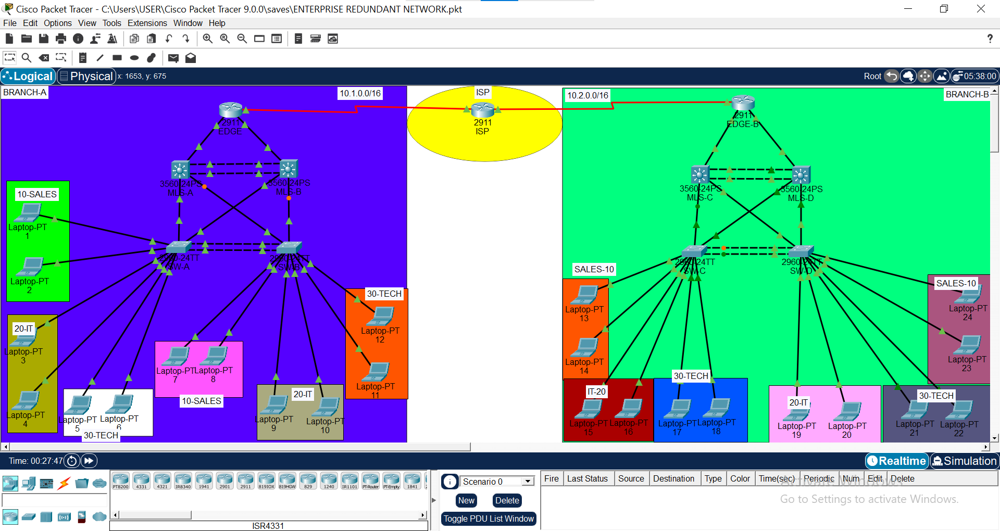
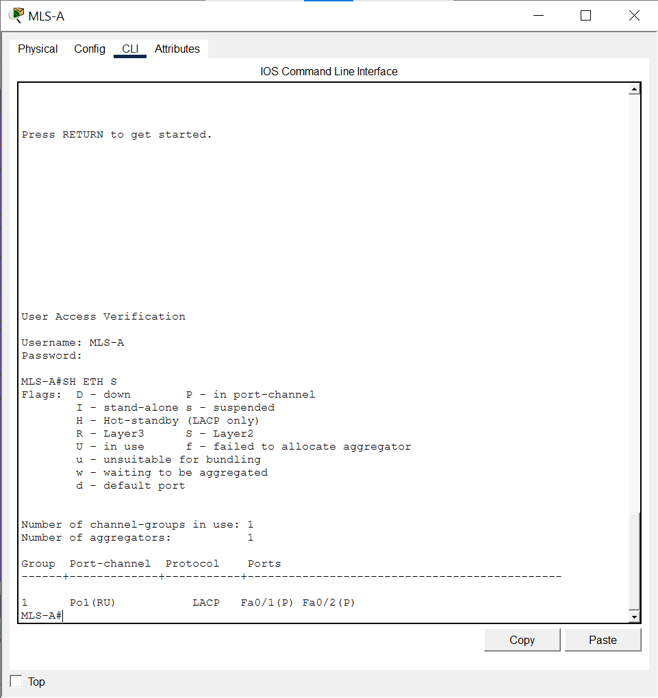
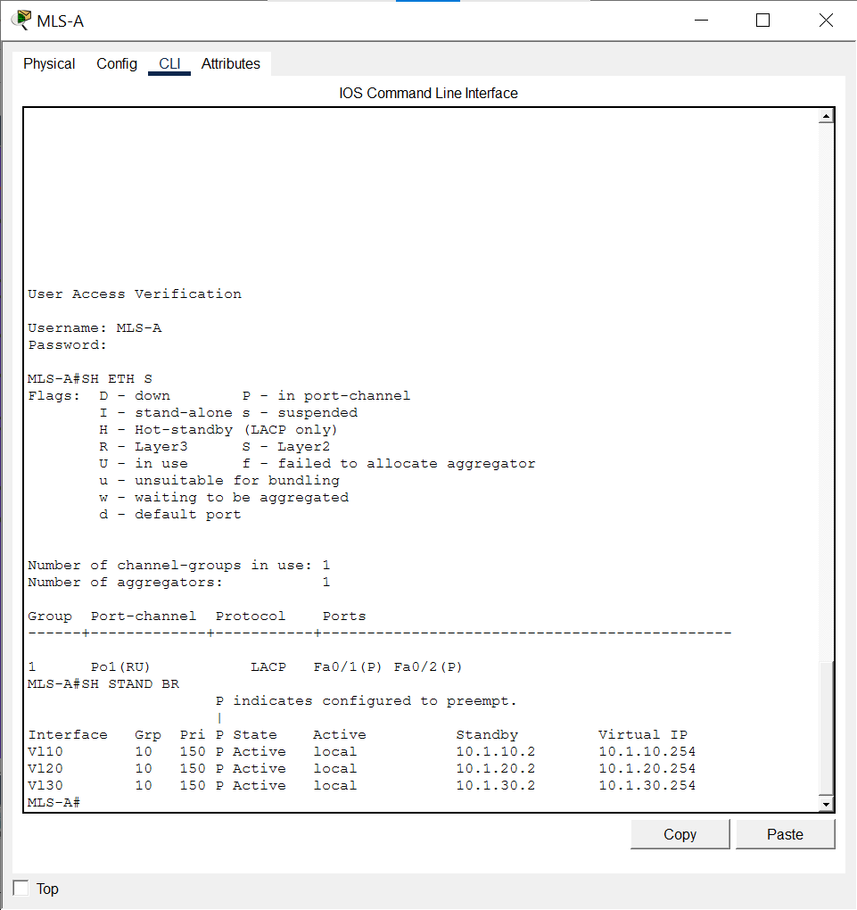
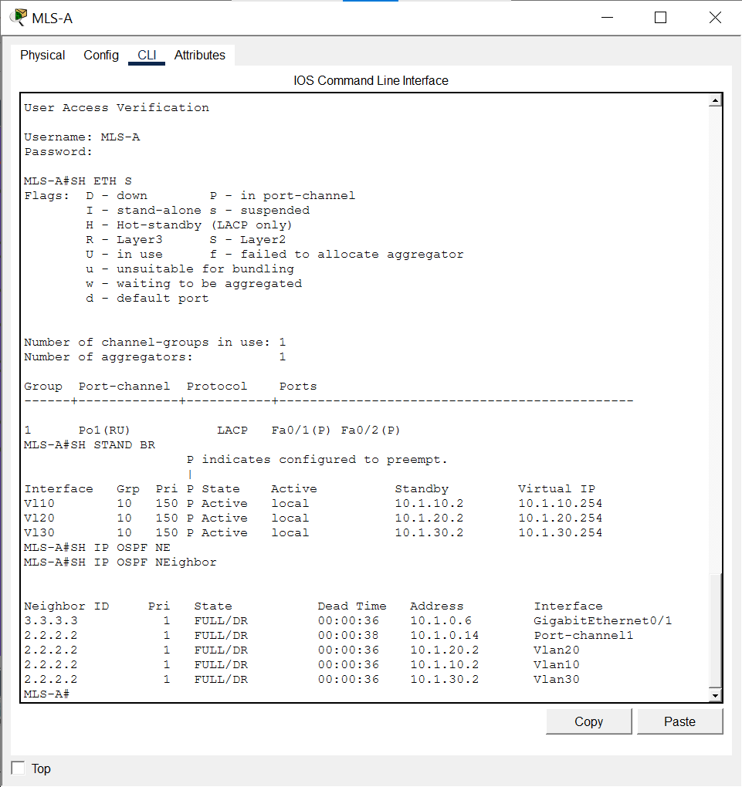
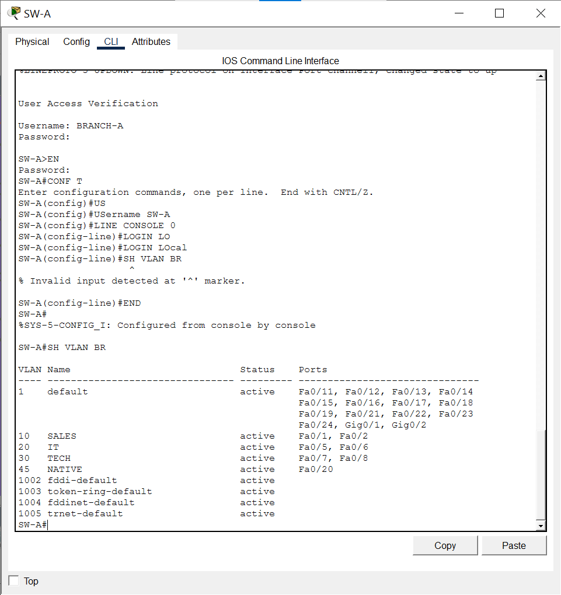
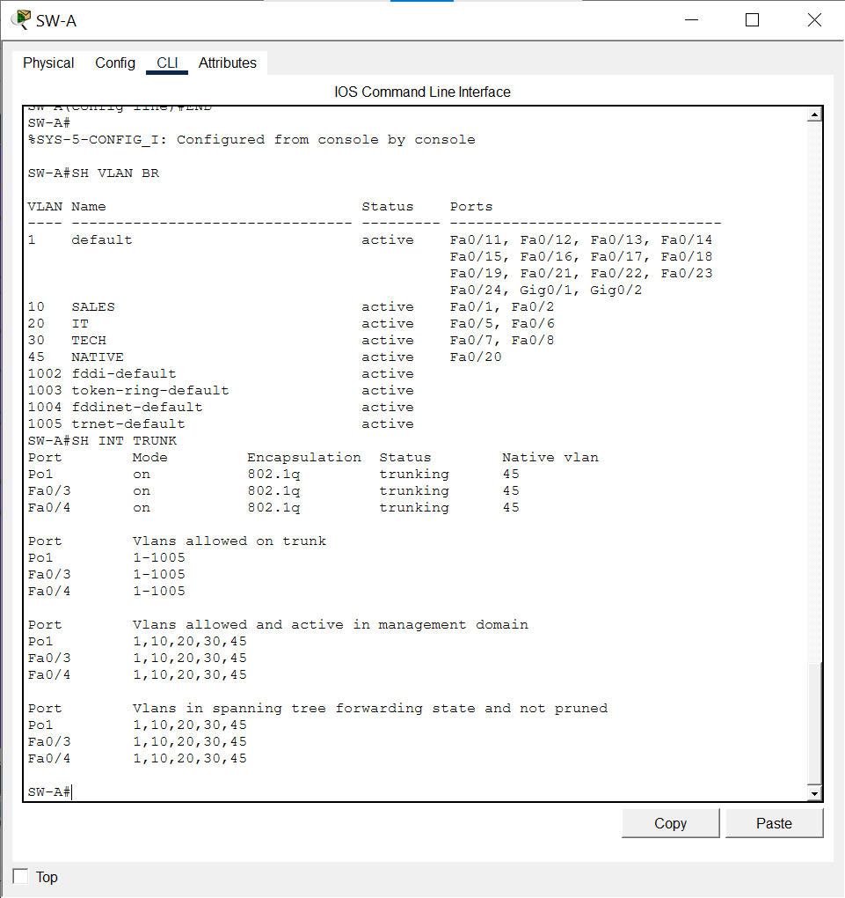
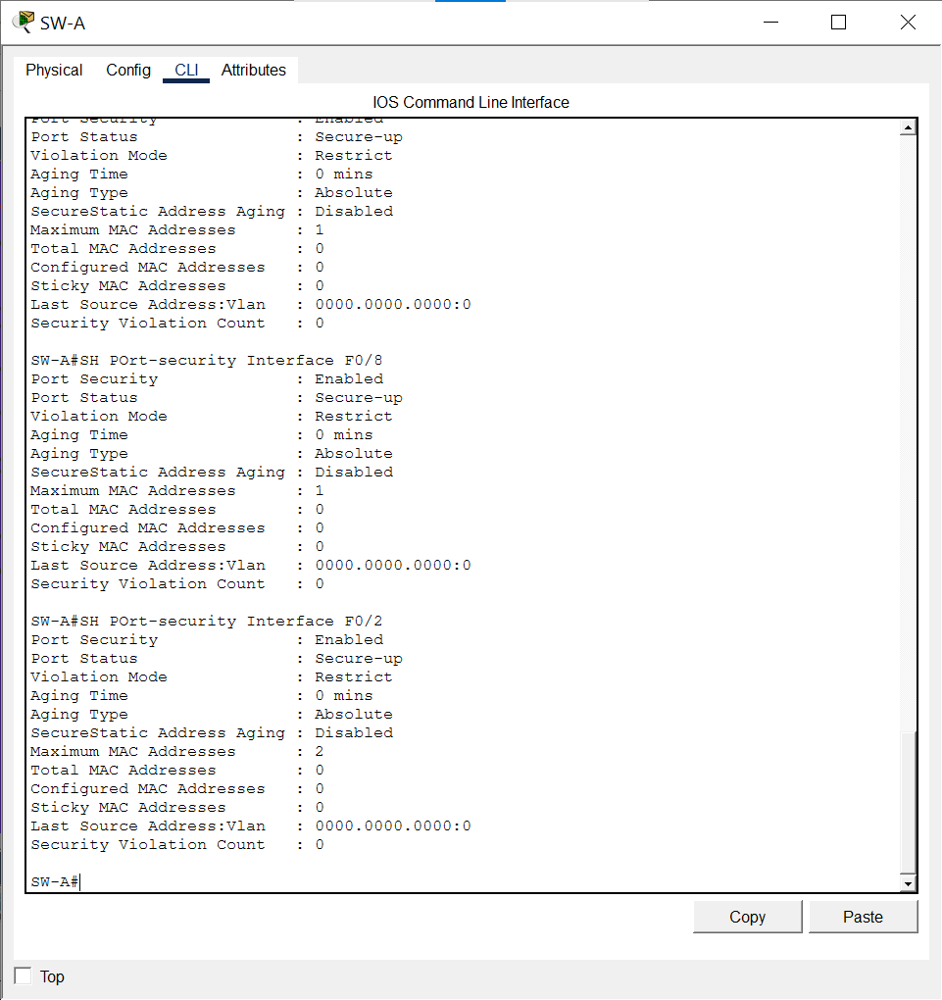
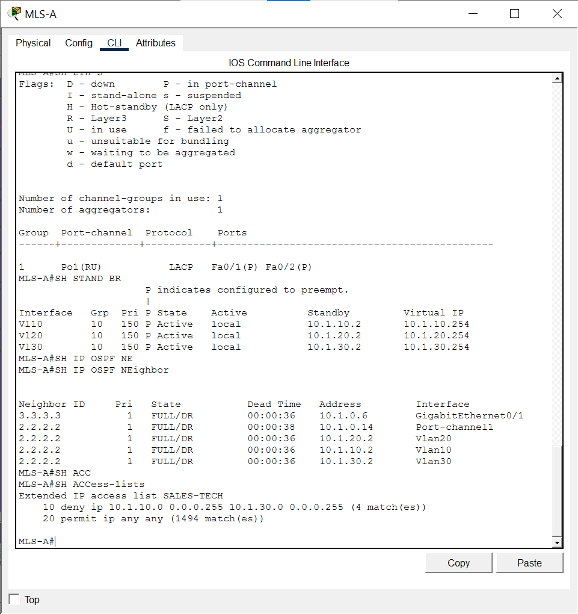
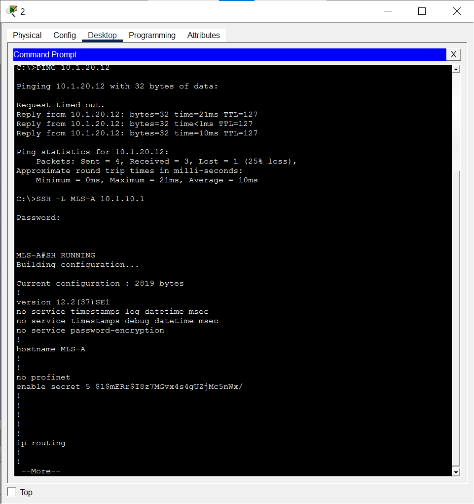

# Enterprise Redundant Network — Dual-Site Campus Build

A two-branch enterprise network built in Cisco Packet Tracer, designed around a classic three-tier architecture with full Layer 2/3 redundancy. This is the capstone piece in my CCNA portfolio series, pulling together routing, switching, and security into one working topology.

## Overview

The network simulates two company branches (Branch A and Branch B) connected across a WAN through an ISP router, each branch built as a self-contained three-tier campus:

- Core/Edge: Cisco 2911 router per branch (EDGE-A, EDGE-B) connecting to the ISP
- Distribution: Dual 3560-24PS multilayer switches per branch (MLS-A/MLS-B, MLS-C/MLS-D) doing inter-VLAN routing
- Access: Dual 2960-24TT switches per branch (SW-A/SW-B, SW-C/SW-D) connecting end devices

Each branch runs three VLANs — Sales, IT, and Tech — with redundant uplinks at every tier so a single link or switch failure doesn't take the branch down.

## Topology

- Branch A: 10.1.0.0/16
- Branch B: 10.2.0.0/16
- WAN link: Branch A EDGE ↔ ISP ↔ Branch B EDGE (serial)
- Redundant distribution-to-access links bundled as EtherChannel
- Dual distribution switches per branch for HSRP failover

## Technologies Implemented

| Feature | Purpose |
|---|---|
| Three-tier hierarchical design | Separation of core, distribution, and access for scalability and fault isolation |
| VLANs (10-Sales, 20-IT, 30-Tech) | Logical segmentation of departments |
| VLSM | Efficient subnet allocation across point-to-point links and VLAN subnets |
| Inter-VLAN routing | Handled at the distribution layer via multilayer switches (no router-on-a-stick) |
| OSPF | Dynamic routing between branches and across the WAN |
| HSRP | First-hop redundancy — active/standby gateway across the paired distribution switches |
| EtherChannel | Link aggregation between distribution switches, and between distribution and access switches, for bandwidth and redundancy |
| Trunking | 802.1Q trunks carrying all VLANs between access and distribution layers |
| Port Security | Restricts access ports to known MAC addresses to prevent unauthorized devices |
| ACLs | Branch A's Sales VLAN (10) is explicitly denied access to the Tech VLAN, enforcing departmental segmentation |
|SSH | all network devices has SSH configured|
## Addressing Scheme

### Branch A — 10.1.0.0/16

| Device | Interface | IP Address | Subnet Mask |
|---|---|---|---|
| EDGE-A | Gi0/1 | 10.1.0.6 | 255.255.255.252 |
| EDGE-A | Gi0/2 | 10.1.0.9 | 255.255.255.252 |
| EDGE-A | Se0/3/0 | 10.0.0.1 | 255.255.255.252 |
| MLS-A | Gi0/1 | 10.1.0.5 | 255.255.255.252 |
| MLS-A | Port-channel1 | 10.1.0.13 | 255.255.255.252 |
| MLS-B | Gi0/2 | 10.1.0.10 | 255.255.255.252 |
| MLS-B | Port-channel1 | 10.1.0.14 | 255.255.255.252 |
| ISP | Se0/3/0 | 10.0.0.2 | 255.255.255.252 |

| VLAN | Subnet | Gateway |
|---|---|---|
| 10 — Sales | 10.1.10.0/24 | 10.1.10.254 |
| 20 — IT | 10.1.20.0/24 | 10.1.20.254 |
| 30 — Tech | 10.1.30.0/24 | 10.1.30.254 |

Native VLAN: 45

### Branch B — 10.2.0.0/16

| Device | Interface | IP Address | Subnet Mask |
|---|---|---|---|
| EDGE-B | Gi0/1 | 10.2.0.6 | 255.255.255.252 |
| EDGE-B | Gi0/2 | 10.2.0.9 | 255.255.255.252 |
| EDGE-B | Se0/3/0 | 10.0.0.21 | 255.255.255.252 |
| MLS-C | Gi0/1 | 10.2.0.5 | 255.255.255.252 |
| MLS-C | Port-channel1 | 10.2.0.13 | 255.255.255.252 |
| MLS-D | Gi0/2 | 10.2.0.10 | 255.255.255.252 |
| MLS-D | Port-channel1 | 10.2.0.14 | 255.255.255.252 |
| ISP | Se0/3/0 | 10.0.0.22 | 255.255.255.252 |

| VLAN | Subnet | Gateway |
|---|---|---|
| 10 — Sales | 10.2.10.0/24 | 10.2.10.254 |
| 20 — IT | 10.2.20.0/24 | 10.2.20.254 |
| 30 — Tech | 10.2.30.0/24 | 10.2.30.254 |

Native VLAN: 50

### EtherChannels

- MLS-A ↔ MLS-B: Port-channel1
- SW-A ↔ SW-B: Port-channel1
- (Mirrored on Branch B between MLS-C/MLS-D and SW-C/SW-D)

## Verification

Command output proving each feature is actually working, not just configured.
EtherChannel

Port-channel1 up, bundling the correct interfaces.

HSRP

show standby brief — active/standby roles and group IP confirmed across the distribution pair.

OSPF

show ip ospf neighbor — adjacency established between branches and the ISP.

show ip route — routes to the remote branch learned via OSPF.

VLANs & Trunking

show vlan brief — VLANs 10/20/30 with correct port assignments.

show interfaces trunk — trunk links up with the correct native VLAN.

Port Security

show port-security interface on an access port — secure MAC learned, violation mode set.

ACL — Sales blocked from Tech

show access-lists — the ACL denying Branch A Sales (VLAN 10) from reaching Branch A Tech (VLAN 30).

Ping from a Sales VLAN host to a Tech VLAN host — timing out as expected.

Ping from a Sales VLAN host to an IT VLAN host — succeeding, showing the ACL is scoped correctly and not blocking everything.

SSH INTO MLS-A

## What This Demonstrates

This project was built to show practical, end-to-end command of the core CCNA syllabus — not just individual configs in isolation, but how routing, switching, redundancy, and security work together in a design that mirrors what a small-to-mid enterprise would actually run across two sites.
